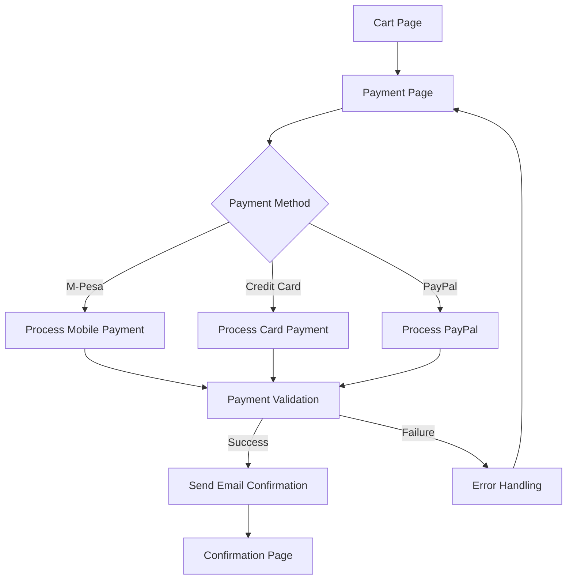

# Billing Feature Documentation

## Overview

The billing system handles payment processing, order confirmation, and email notifications for the Vice Queen Industries e-commerce platform.

## Architecture Flow



## Component Flow

1. **Cart → Payment**

   - User reviews cart items
   - Calculates subtotal, shipping, and tax
   - Proceeds to payment page

2. **Payment Form**

   - Payment method selection:
     - M-Pesa
     - Credit Card
     - PayPal
   - Delivery details:
     - Region selection
     - Town selection
   - Billing information:
     - First name
     - Last name
     - Email address

3. **Payment Processing**
   ```typescript
   - Validate form inputs
   - Format payment data
   - Initialize payment transaction
   - Handle payment response
   - Send confirmation email
   - Redirect to confirmation page
   ```

## Data Flow

### 1. Payment Initialization

```typescript
interface PaymentData {
  paymentMethod: string;
  phoneNo?: string;
  amount: number;
  deliveryDetails: {
    region: string;
    town: string;
  };
  billingAddress: {
    firstname: string;
    lastname: string;
    email: string;
  };
}
```

### 2. Email Confirmation

```typescript
interface EmailData {
  to: string;
  subject: string;
  transactionDetails: {
    orderId: string;
    items: CartItem[];
    total: number;
    billingAddress: BillingAddress;
    deliveryDetails: DeliveryDetails;
  };
}
```

## Error Handling

1. **Payment Validation**

   - Phone number format (M-Pesa)
   - Required fields validation
   - Amount validation

2. **Payment Processing**

   - Network errors
   - Payment gateway errors
   - Transaction timeouts

3. **Email Confirmation**
   - Email sending failures
   - Invalid email format
   - Server errors

## Security Measures

1. **Data Protection**

   - Form validation using Yup
   - Input sanitization
   - Secure API endpoints

2. **Payment Security**
   - SSL/TLS encryption
   - Payment gateway integration
   - Secure token handling

## Integration Points

1. **Payment Gateway**

   ```typescript
   // Payment processing
   const processPayment = async (paymentData: PaymentData) => {
     return await apiRequest.post("/api/payments", paymentData);
   };
   ```

2. **Email Service**
   ```typescript
   // Email confirmation
   const sendConfirmation = async (emailData: EmailData) => {
     return await apiRequest.post("/api/email/transaction", emailData);
   };
   ```

## Testing Scenarios

1. **Payment Processing**

   - Successful payment
   - Failed payment
   - Timeout scenarios
   - Invalid input handling

2. **Email Confirmation**
   - Successful email delivery
   - Failed email delivery
   - Email content validation

## Success Metrics

1. **Performance**

   - Payment processing time < 3s
   - Email delivery time < 30s
   - Form submission time < 1s

2. **Reliability**
   - Payment success rate > 98%
   - Email delivery rate > 99%
   - Error handling success rate > 95%

## Maintenance Considerations

1. **Monitoring**

   - Payment gateway status
   - Email service status
   - Error logs tracking

2. **Updates**
   - Payment gateway API versions
   - Security patches
   - UI/UX improvements
